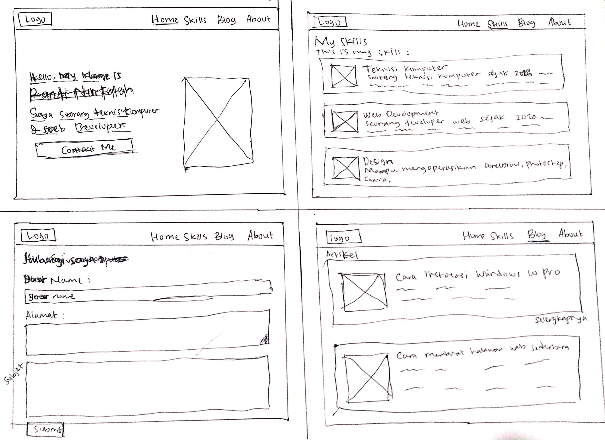
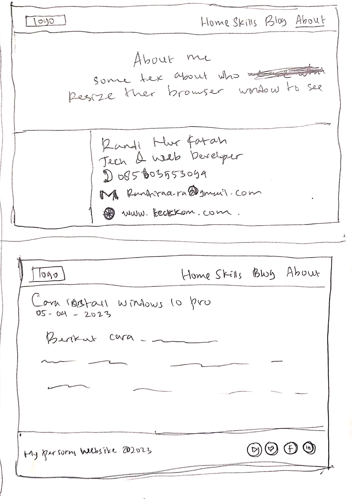

# Personal Website With HTML & CSS
Create a simple personal website using only HTML and CSS.  
Feature :  
* HomePage & Contact Form
* Skills
* Article Pages & Content Articles
* About

## Wireframe
  


## File HTML & CSS
```
index.html (HomePage & Contact Form)
skills.html
article.html
content-article.html
about.html
style.css
```
